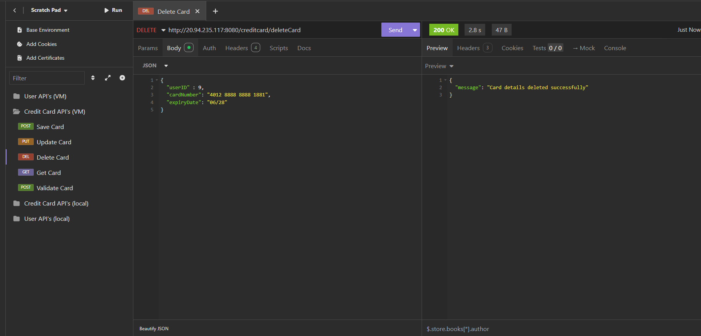

# CreditCard Management Project

#### Project Overview
The Credit Card Management System is a Spring Boot based Java application designed to securely manage user and credit card information. It integrates with Azure Key Vault for secret storage and Azure Database for PostgreSQL for persistent data management.

#### Core Features
- **User Management** — Create, updates and deletes user profiles.

- **Credit Card Management** — Store credit card details securely using Azure Key Vault, validates card details using Luhn's algorithm. Supports other CRUD operations such as update, delete and get card details.

#### Architecture Overview

- **Azure Key Vault (AKV)** - Provides secure storage and management of sensitive information (i.e., credit card details).  
- **Azure Database for PostgreSQL server** - Stores metadata information for User and CreditCard.

### Key Components
- **Controllesr Layer** - Handles API requests and responses (e.g., UserController, CreditCardController).
- **Data Access Layer** - Connects to Azure Database for PostgreSQL server to store and retrieve application data.
- **CreditCardAkvSecretHandler.java** - Handler class to interact with Azure Key Vault for storing, updating, retrieving and deleting credit card information stored as secrets.

### Deployment
- The application is hosted on Azure Virtual Machine (VM).

#### Database Schema

#### API Design
##### User Controller API's
- POST /user/createUser -- Create User
- GET /user/getUser/{userId} -- Fetch user details for a given user
- DELETE /user/deleteUser/{userId} -- Delete user details for a given user
- PUT /user/updateUser/{userId} -- Update user details for a given user

##### Credit Card Controller API's
- POST /creditcard/saveCard -- Add credit card details
- PUT /creditcard/updateCard -- Update credit card details
- DELETE /creditcard/deleteCard -- Delete credit card details
- GET /creditcard/getCard/{userId} -- Fetch credit card details for a user
- POST /creditcard/validateCard -- Validate credit card details 

For API Request and Response, refer to section [API Request / Response](#api-request-response)

#### Sequence Diagram

###### Create User

###### Update User

###### Delete User

###### Get User

###### Save Card

###### Update Card

###### Delete Card

###### Get Card

###### Validate Card

#### Getting Started

##### Prerequisites
- Java 17+
- Maven
- Azure subscription
- Azure key vault
- Azure Database for PostgreSQL server

##### Setup
   1. Clone the repository:  
	   git clone clone_url
   
   2. Configure AKVConstants.java and DatabaseConstants.java files with your Azure DB and Key vault details
      
   3. Navigate into the project folder:  
   	   cd "path-to-project-folder"
   
   4. Run below command to install pom.xml dependency jar files:  
   	   mvn clean install
   
   5. Run the app using the command:  
       mvn spring-boot:run  
				OR  
	   Right click on the project application class file - Run As - Java application
 
#### API Request / Response

###### Create User

###### Get User Details

###### Update User

###### Get User Details

###### Delete User

###### Get User Details

###### Save Card

###### Get Card Details

###### Update Card (Expiry Date update)

###### Get Card Details

###### Delete Card

###### Get Card Details

###### Card Validation - Success

###### Card Validation - Luhn Error

###### Card Validation - Card Type Error

###### Card Validation - Expiry Error

###### Card Validation - Length Error

###### Card Validation - Blacklist Error
